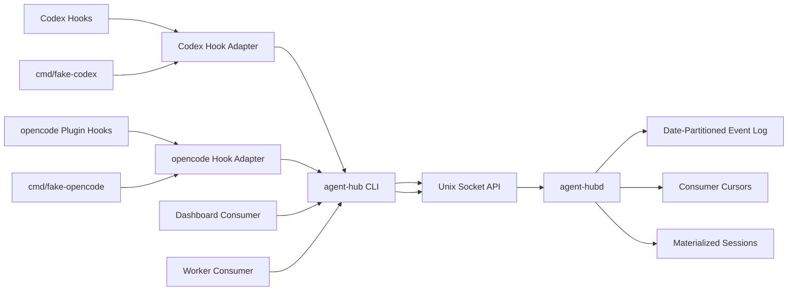
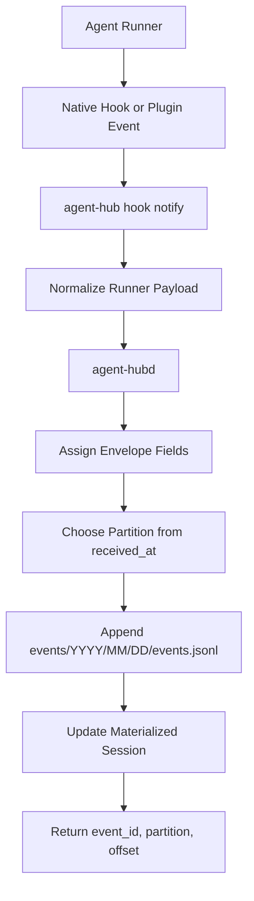
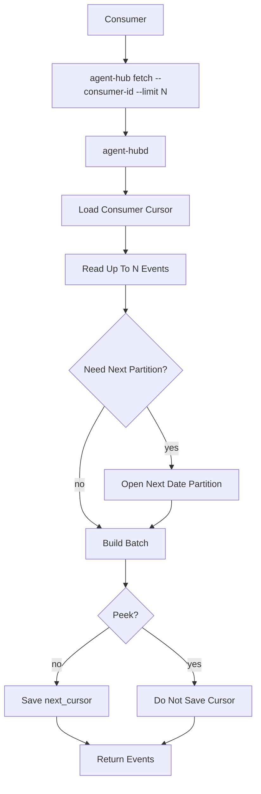
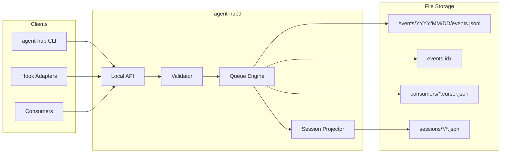
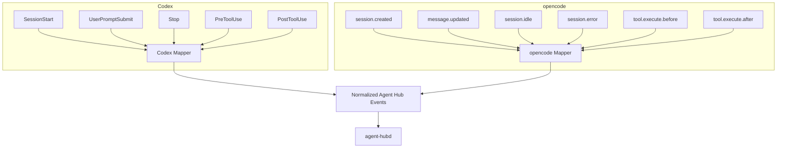
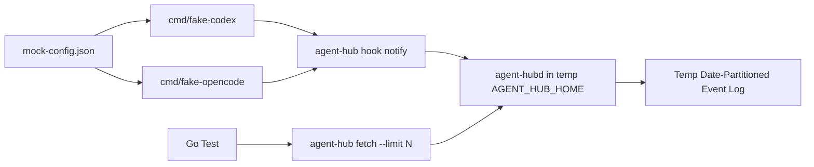

# Agent Hub Architecture

Agent Hub is a local event broker and orchestration daemon for agent runner
sessions. Producers publish normalized lifecycle events; consumers read from
independent cursors.

## Components



## Daemon Responsibilities

`agent-hubd` is the only process that mutates storage. It is responsible for:

- validating normalized events
- assigning `event_id`, `partition`, `offset`, and `received_at`
- appending to date-partitioned JSONL logs
- updating consumer cursors atomically
- maintaining materialized session state
- rebuilding indexes on startup
- exposing health and inspection data

## Producer Flow



## Consumer Flow



## Storage Boundary



## Runner Integration Layers



## Normalized Event Types

- `agent.session.started`
- `agent.prompt.submitted`
- `agent.session.updated`
- `agent.session.finished`
- `agent.session.failed`
- `agent.tool.started`
- `agent.tool.finished`
- `agent.permission.requested`
- `agent.permission.replied`

## API Transport

Unix socket is the primary v1 transport:

```text
.agent-hub/agent-hub.sock
```

An optional localhost HTTP listener can be added for dashboards and external
tools:

```sh
agent-hub daemon start --http 127.0.0.1:0
```

The daemon API should be transport-neutral internally so the CLI can use the
same request and response models for Unix socket and HTTP.

## Test Harness



Fake runners must ignore host Codex and opencode config. They only fire hooks
declared in `--mock-config`.

