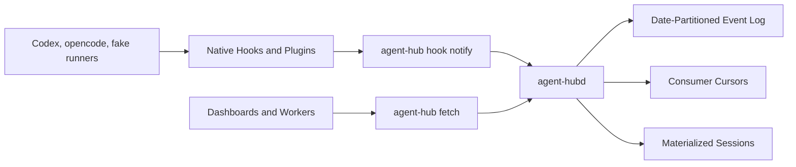

# Agent Hub Design

Agent Hub is a local daemon-backed queue for agent runner lifecycle events. It
lets Codex, opencode, fake runners, dashboards, and workers coordinate through a
single event stream without depending on any runner-specific storage format.

## Summary

`agent-hubd` runs as a local daemon. Agent runners publish lifecycle events
through native hooks or plugins. The CLI normalizes hook payloads and sends them
to the daemon. The daemon appends accepted events to date-partitioned JSONL
files and maintains consumer cursors like a small local Kafka-style queue.

Consumers call:

```sh
agent-hub fetch --consumer-id dashboard --limit 10
```

Each consumer has its own cursor:

```json
{
  "partition": "2026-06-10",
  "offset": 42
}
```

The cursor points to the next event to read. `offset` is a logical event
position inside a date partition.

## Goals

- Track agent sessions from multiple runners.
- Keep one central queue per workspace or configured home.
- Allow independent consumers with independent offsets.
- Use file storage only.
- Partition event logs by date.
- Integrate with Codex and opencode through hooks.
- Test integrations through fake runners without touching host config.

## Non-Goals

- No SQLite or external database.
- No distributed broker semantics.
- No direct writes from CLI clients to queue files.
- No dependency on real Codex or opencode configuration during tests.

## Architecture



The daemon owns:

- event validation
- envelope assignment
- queue append
- cursor update
- session projection
- recovery and index rebuild

## Event Model

Producers send normalized events:

```json
{
  "event_type": "agent.session.started",
  "runner": "codex",
  "runner_session_id": "codex-thread-123",
  "workspace": "/repo",
  "model": "gpt-5",
  "prompt": "initial user prompt",
  "occurred_at": "2026-06-10T12:00:00Z",
  "payload": {}
}
```

The daemon stores an envelope:

```json
{
  "schema_version": "agent-hub.event.v1",
  "event_id": "01J00000000000000000000000",
  "partition": "2026-06-10",
  "offset": 42,
  "received_at": "2026-06-10T12:00:01Z",
  "producer": {
    "cli_version": "v0.1.0",
    "hostname": "devbox",
    "pid": 12345
  },
  "event": {
    "event_type": "agent.session.started",
    "runner": "codex",
    "runner_session_id": "codex-thread-123",
    "workspace": "/repo",
    "model": "gpt-5",
    "prompt": "initial user prompt",
    "occurred_at": "2026-06-10T12:00:00Z",
    "payload": {}
  }
}
```

Primary v1 event types:

- `agent.session.started`
- `agent.prompt.submitted`
- `agent.session.updated`
- `agent.session.finished`
- `agent.session.failed`
- `agent.tool.started`
- `agent.tool.finished`
- `agent.permission.requested`
- `agent.permission.replied`

## Storage

Events are stored under the daemon home:

```text
.agent-hub/events/YYYY/MM/DD/events.jsonl
```

Example:

```text
.agent-hub/events/2026/06/10/events.jsonl
```

The partition is selected from daemon `received_at`, not producer timestamps.
This keeps append behavior predictable even when a runner sends old timestamps.

Consumer cursors live under:

```text
.agent-hub/consumers/<consumer-id>.cursor.json
```

Materialized sessions live under:

```text
.agent-hub/sessions/active/
.agent-hub/sessions/completed/
.agent-hub/sessions/failed/
```

The event log is authoritative. Indexes, cursors, and session files can be
validated or rebuilt from the log.

## CLI

Producer:

```sh
agent-hub notify --json '{...}'
agent-hub hook notify --runner codex --event SessionStart < payload.json
agent-hub hook notify --runner opencode --event session.created < payload.json
```

Consumer:

```sh
agent-hub fetch --consumer-id dashboard
agent-hub fetch --consumer-id dashboard --limit 10
agent-hub fetch --consumer-id dashboard --limit 10 --peek
```

Daemon:

```sh
agent-hub daemon start
agent-hub daemon status --json
agent-hub daemon stop
```

Inspection:

```sh
agent-hub sessions --json
agent-hub consumers --json
agent-hub partitions --json
```

## Fetch Semantics

`fetch` defaults to `--limit 1`. It returns up to `N` available events. It may
return fewer than `N` if the queue currently has fewer events. It may cross date
partitions in one batch.

Default `fetch` advances the cursor atomically after reading the batch.
`--peek` does not advance.

Empty response:

```json
{
  "consumer_id": "dashboard",
  "events": [],
  "previous_cursor": {
    "partition": "2026-06-10",
    "offset": 42
  },
  "next_cursor": {
    "partition": "2026-06-10",
    "offset": 42
  },
  "has_more": false
}
```

## Codex Integration

Codex integration should use Codex hooks. The adapter command is:

```sh
agent-hub hook notify --runner codex --event <CodexEvent>
```

Recommended mapping:

| Codex event | Agent Hub event |
| --- | --- |
| `SessionStart` | `agent.session.started` |
| `UserPromptSubmit` | `agent.prompt.submitted` |
| `Stop` | `agent.session.finished` |
| `PreToolUse` | `agent.tool.started` |
| `PostToolUse` | `agent.tool.finished` |
| `PermissionRequest` | `agent.permission.requested` |
| `SubagentStart` | `agent.session.updated` |
| `SubagentStop` | `agent.session.updated` |

`SessionStart` may not contain the initial user prompt. `UserPromptSubmit`
should be used to attach prompt text to the active session when available.

## opencode Integration

opencode integration should use an opencode plugin that calls:

```sh
agent-hub hook notify --runner opencode --event <opencode-event>
```

Recommended mapping:

| opencode event | Agent Hub event |
| --- | --- |
| `session.created` | `agent.session.started` |
| `message.updated` | `agent.prompt.submitted` or `agent.session.updated` |
| `session.status` | `agent.session.updated` |
| `session.idle` | `agent.session.finished` |
| `session.error` | `agent.session.failed` |
| `tool.execute.before` | `agent.tool.started` |
| `tool.execute.after` | `agent.tool.finished` |
| `permission.asked` | `agent.permission.requested` |
| `permission.replied` | `agent.permission.replied` |

The plugin should be thin. It should pass native payloads to `agent-hub hook
notify`; normalization belongs in the Agent Hub adapter.

## Fake Runner Harness

Real runner config must not be used in integration tests. Tests should use:

```text
cmd/fake-codex
cmd/fake-opencode
```

Both fake runners should support:

```sh
--mock-config <config-file>
```

Example:

```sh
fake-codex exec --json --mock-config /tmp/mock.json "prompt"
fake-opencode run --format json --mock-config /tmp/mock.json "prompt"
```

Mock config schema:

```json
{
  "version": "agent-pro.fake-runner.v1",
  "runner": "fake-codex",
  "session_id": "sess_123",
  "model": "gpt-5",
  "delay_ms": 0,
  "exit_code": 0,
  "stderr": "",
  "ignore_hook_errors": true,
  "hook_command": "agent-hub hook notify --runner fake-codex --event {{event}}",
  "stdout_events": [
    {
      "type": "item.completed",
      "item": {
        "id": "m1",
        "type": "message",
        "text": "fake codex answered",
        "status": "completed"
      }
    }
  ],
  "hooks": [
    {
      "at": "before_stdout",
      "event": "SessionStart",
      "payload": {
        "source": "startup"
      }
    },
    {
      "at": "after_stdout",
      "event": "Stop",
      "payload": {
        "reason": "completed"
      }
    }
  ]
}
```

Supported hook timings:

- `before_start`
- `before_stdout`
- `after_stdout`
- `before_exit`
- `on_error`

Fake runners ignore host config and only fire hooks declared in
`--mock-config`.

## Test Plan

Implementation should include rerunnable Go tests for:

- `fake-codex --mock-config` emits configured stdout events
- `fake-codex --mock-config` fires configured hook commands
- `fake-opencode --mock-config` emits opencode-compatible JSONL
- `fake-opencode --mock-config` fires configured hook commands
- Codex hook payloads normalize into Agent Hub event types
- opencode hook payloads normalize into Agent Hub event types
- daemon appends events under `events/YYYY/MM/DD/events.jsonl`
- daemon assigns monotonically increasing partition offsets
- `fetch --limit N` returns batches in partition and offset order
- `fetch --peek` does not advance consumer cursor
- consumer cursors cross date partitions correctly
- session state is rebuilt after daemon restart
- tests use only `t.TempDir()` storage roots

Expected batch response:

```json
{
  "consumer_id": "test",
  "events": [
    {
      "partition": "2026-06-10",
      "offset": 0,
      "event_type": "agent.session.started",
      "runner": "fake-codex"
    },
    {
      "partition": "2026-06-10",
      "offset": 1,
      "event_type": "agent.session.finished",
      "runner": "fake-codex"
    }
  ],
  "next_cursor": {
    "partition": "2026-06-10",
    "offset": 2
  }
}
```

## Open Questions

- Whether to expose localhost HTTP in v1 or keep it behind a flag.
- Whether to add leased fetch plus explicit ack in v1 or leave it as a future
  worker mode.
- Whether session IDs should be globally unique or namespaced by runner in all
  public commands.

