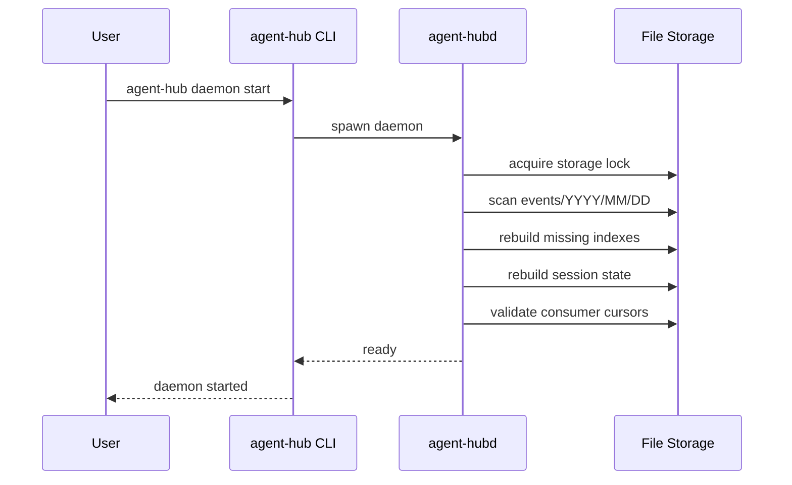
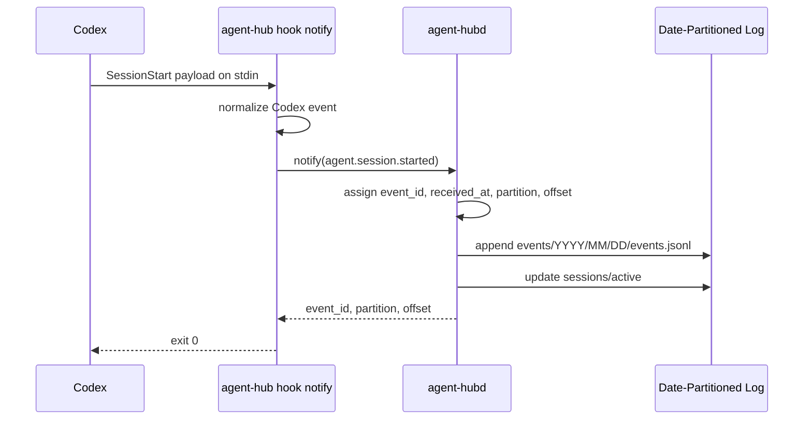
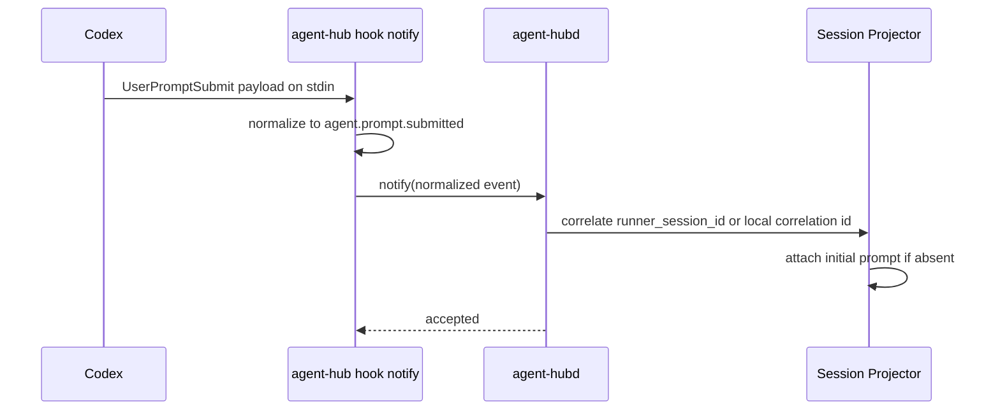
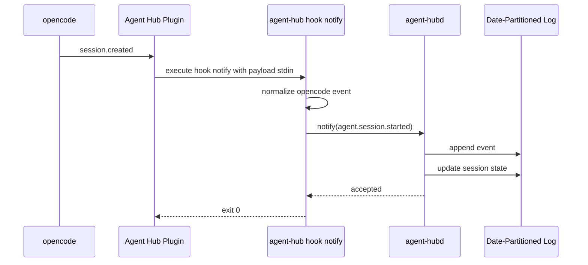
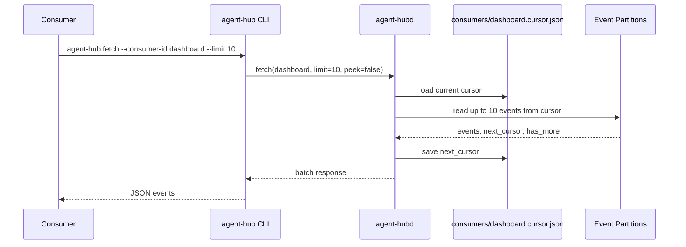
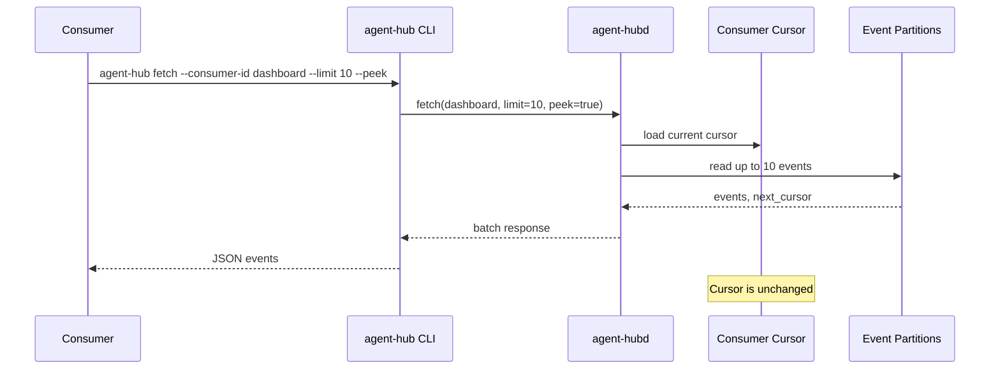
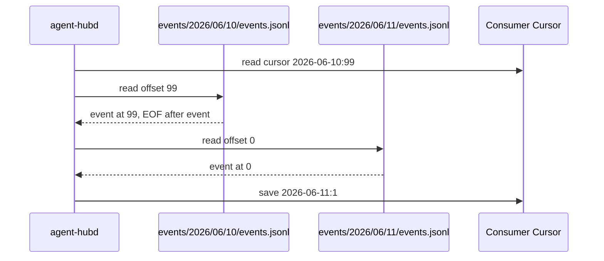
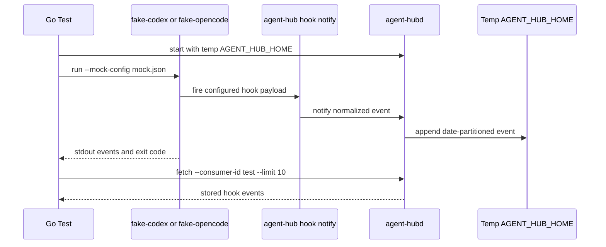
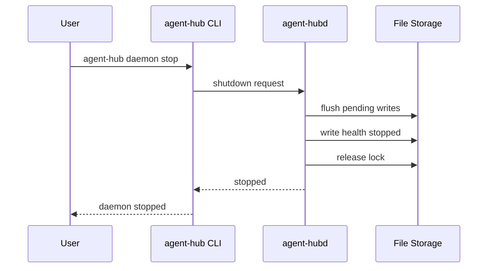

# Agent Hub Interaction Sequences

All diagrams are written in Mermaid and describe the expected v1 interaction
patterns.

## Daemon Startup

## Codex Hook Notification

## Codex Prompt Correlation

## opencode Plugin Notification

## Batch Fetch With Cursor Advance

## Peek Fetch Without Cursor Advance

## Crossing Date Partitions

## Fake Runner Integration Test

## Daemon Shutdown

