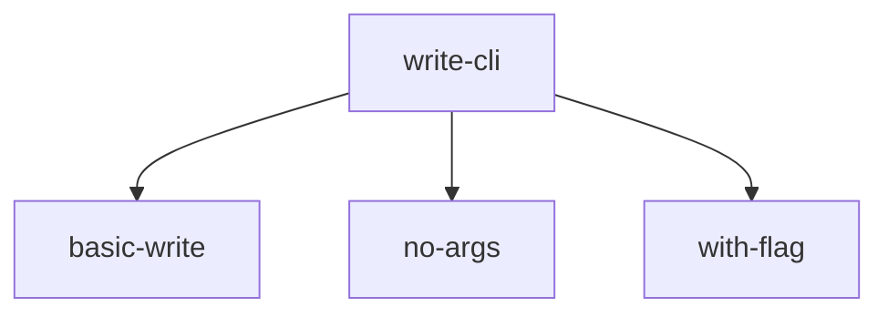

# write-cli Test Cases

A CLI tool that writes text to stdout with optional prefix, suffix, and uppercase
transformations.

## Test Case Tree



```
write-cli-test-cases
├── basic-write
│   ├── SETUP.md
│   └── ASSERT.md
├── no-args
│   ├── SETUP.md
│   └── ASSERT.md
└── with-flag
    ├── SETUP.md
    └── ASSERT.md
```

## Test Case Index

| # | Test Case | Description |
|---|-----------|-------------|
| 1 | basic-write | Write plain text to stdout |
| 2 | no-args | Exit with error when no arguments provided |
| 3 | with-flag | Use --uppercase flag to transform output |
