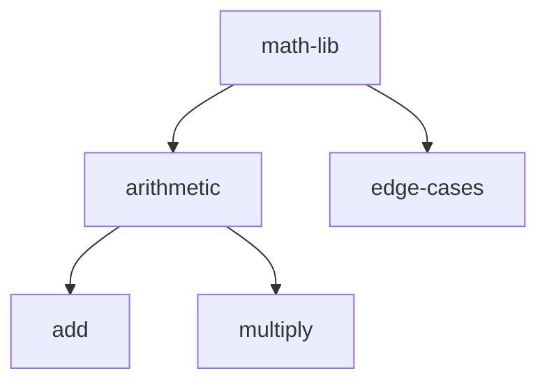

# math-lib Test Cases

A Go library providing arithmetic functions: Add and Multiply.

## Test Case Tree



```
math-lib-test-cases
├── SETUP.md
├── arithmetic/
│   ├── add/
│   │   ├── SETUP.md
│   │   └── ASSERT.md
│   └── multiply/
│       ├── SETUP.md
│       └── ASSERT.md
└── edge-cases/
    ├── SETUP.md
    └── ASSERT.md
```

## Test Case Index

| # | Test Case | Description |
|---|-----------|-------------|
| 1 | add | Add two positive integers |
| 2 | multiply | Multiply two positive integers |
| 3 | edge-cases | Add negative numbers and zero |
