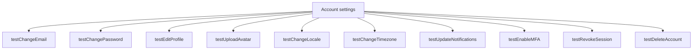

# 2-depth 10-case example

## DOT graph

```mermaid
graph TD
  root[Account settings] --> email[testChangeEmail]
  root --> password[testChangePassword]
  root --> profile[testEditProfile]
  root --> avatar[testUploadAvatar]
  root --> locale[testChangeLocale]
  root --> timezone[testChangeTimezone]
  root --> notifications[testUpdateNotifications]
  root --> mfa[testEnableMFA]
  root --> sessions[testRevokeSession]
  root --> deleteAccount[testDeleteAccount]
```

## Text tree
- Account settings
  - 10 runnable leaf cases at depth 2

## File index
Each child directory contains its own SETUP.md and ASSERT.md.
