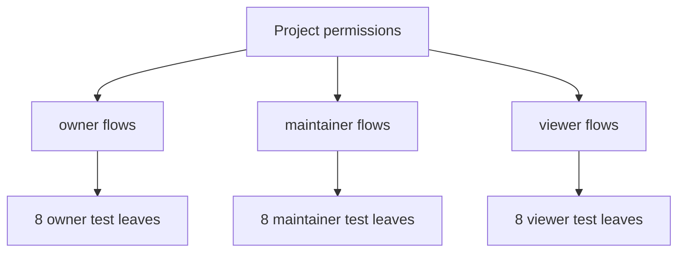

# 3-depth 24-case example

## DOT graph

## Text tree
- Project permissions
  - owner: 8 runnable leaves
  - maintainer: 8 runnable leaves
  - viewer: 8 runnable leaves

## File index
This example demonstrates a root, a mode layer, and leaf test cases at depth 3.
