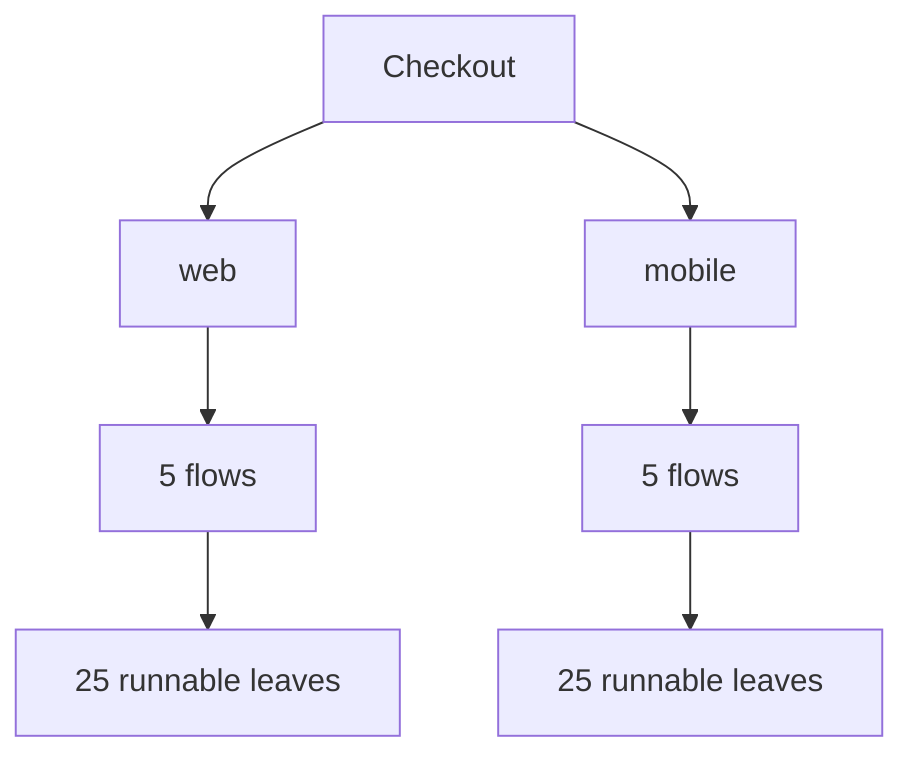

# 5-depth 50-case example

## DOT graph

## Text tree
- Checkout
  - entrypoint layer: web, mobile
  - flow layer: cart, shipping, payment, promotion, receipt
  - variant layer: guest, registered, business, international, retry
  - leaf layer: one runnable test under each variant

## File index
This example demonstrates a five-level decision tree with 50 runnable test cases.
